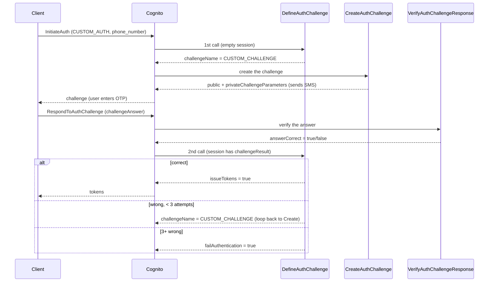

# Custom Auth Challenge Flow (Cognito + Lambda)

The three Lambda triggers form a loop driven by Cognito's `CUSTOM_AUTH` flow,
wired together in `src/aws/cognitosetup/main.tf` via `lambda_config`.

- **DefineAuthChallenge** = orchestrator: decides what happens (issue challenge, issue tokens, retry, or fail)
- **CreateAuthChallenge** = producer: generates/reuses the OTP and sends the SMS
- **VerifyAuthChallengeResponse** = judge: scores the submitted answer against the stored hash

## Connection points

1. **Define → Create**: When DefineAuthChallenge responds with
   `challengeName: "CUSTOM_CHALLENGE"`, Cognito automatically invokes
   CreateAuthChallenge to produce that challenge.
2. **Create → Verify**: CreateAuthChallenge puts the OTP's hash and expiry into
   `event.response.privateChallengeParameters`. Cognito holds these and passes them back to VerifyAuthChallengeResponse.
   Verify re-hashes the submitted code with the same `OTP_HASH_SECRET` and
   compares.
3. **Verify → Define (via the session)**: Verify only sets
   `event.response.answerCorrect`. Cognito records that as `challengeResult`
   in the session history, then calls DefineAuthChallenge again — which reads
   `event.request.session` to decide: issue tokens, re-issue the challenge
   (triggering Create again), or fail after `MAX_ATTEMPTS = 3`.
4. **Shared state**:
   - `random_password.otp_hash_secret` in `login_challenge.tf` is injected as
     `OTP_HASH_SECRET` into both Create and Verify — that's what makes the
     hash comparison work.
   - The `yami-login-otp` DynamoDB table lets Create reuse an unexpired code
     (no new SMS) when Define re-issues the challenge after a wrong attempt.
